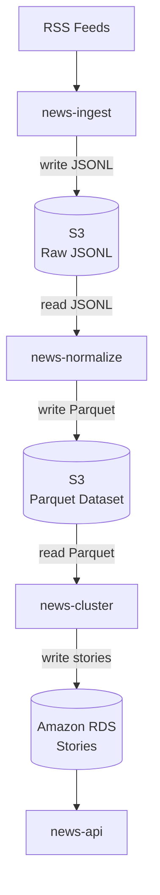

# news-pipeline

A modular, batch-oriented news processing pipeline that ingests raw articles, enriches them with NLP and embeddings, clusters them into stories, and exposes the results via an API.

The pipeline is designed for correctness, re-runnability, and transparency over raw speed. Each stage is isolated, deterministic, and produces explicit, versioned outputs suitable for downstream analysis and serving.

## Repository Layout

- `services/news-ingest` – RSS fetch + content resolution to JSONL
- `services/news-normalize` – entity/locations, embeddings, Parquet output
- `services/news-cluster` – clustering and story aggregation
- `services/news-contextualize` – (planned) enrichment stage
- `services/news-api` – read-only API over clustered data

## How It Works

Overview

1. Ingest – fetch raw articles from RSS feeds and store them immutably
2. Normalize – clean text, extract entities, resolve locations, generate embeddings
3. Cluster – group related articles into stories using semantic similarity
4. Contextualize – (planned) enrich stories with data, generate titles/summaries
5. Serve – expose articles and stories via a read-only API

## GitHub Actions

| Action    | YAML file        | Schedule                                |
| --------- | ---------------- | --------------------------------------- |
| Ingest    | `ingest.yaml`    | Scheduled – every 6 hours               |
| Normalize | `normalize.yaml` | Manual (workflow dispatch)              |
| Cluster   | `cluster.yaml`   | Manual (workflow dispatch)              |
| Reset     | `reset.yaml`     | Manual (workflow dispatch, destructive) |

## Architecture

## Requirements

- Python 3.12+
- Poetry
- AWS S3 (or compatible)
- PostgreSQL (for ingest state tracking)

## License

MIT
