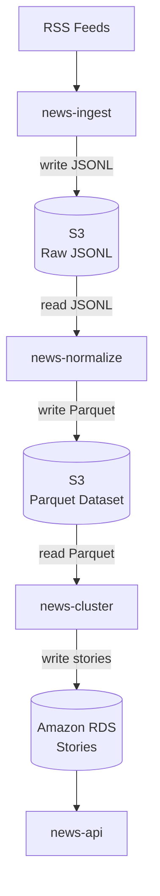

# news-pipeline

A modular news processing pipeline that ingests articles from major news sources, extracts entities, and prepares data for downstream analysis.

## Pipeline Stages

| Stage | Status      | Description |
|-------|-------------|-------------|
| **news-ingest** | Implemented | Fetches articles from RSS feeds, resolves full content, stores as JSONL |
| **news-normalize** | Implemented | Extracts named entities (NER), ranks locations, outputs Parquet |
| **news-cluster** | Implemented | Article clustering and topic grouping |
| **news-contextualize** | Planned     | Knowledge graph linking and enrichment |
| **news-api** | Planned     | REST API for querying processed articles |

## GitHub Actions

- **ingest.yaml**: Runs every 6 hours, fetches new articles
- **normalize.yaml**: Manual workflow to process articles for a given date
- **reset.yaml**: Manual workflow to clear all pipeline state (destructive)

## Architecture


## Requirements

- Python 3.12+
- Poetry
- AWS S3 (or compatible)
- PostgreSQL (for ingest state tracking)

## Setup

```bash
# Install dependencies
poetry install

# Copy environment template
cp .env.example .env
# Edit .env with your credentials
```

## Usage

```bash
# Run ingestion (fetches new articles)
poetry run python news-ingest/ingest.py --config prod

# Run normalization (processes today's articles)
poetry run python news-normalize/normalize.py --config prod

# Process a specific date
poetry run python news-normalize/normalize.py --config prod --period 2026-01-01
```

## Configuration

Each service has `configs/prod.yaml` and `configs/test.yaml`:

- **prod**: S3 storage, PostgreSQL state, transformer NER model
- **test**: Local filesystem, in-memory state, lightweight NER model

## License

MIT
